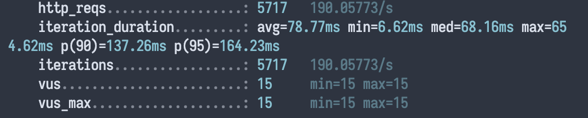

# Load Test for big datasets

This is a load test for big datasets focusing on scalability for huge tables for SQL engines.
For this purpose been selected PostgreSQL.

# Requirements

- Node.js
- Docker
- Some SQL database GUI (DataGrip, DBeaver, Postico, etc)
- (optional) [k6 load tester](https://k6.io/docs/getting-started/installation/)

# How to run

Before all

```bash
$ yarn install
```

1. Start attached docker compose `docker-compose up`
2. Run tests with `yarn test`
3. Generate a new dataset `yarn generate`, this will generate millions of entries for the database (10mln for the transactions table) (wait...)
4. Open your database GUI
5. Connect to `localhost:5432` with user `root` and password `root`
6. Copy data from `./_db/start.sql` and execute all statements on `postgres` database (wait...)
7. You are ready to test with Postman at url `http://localhost:3000/user/:userId/analytics/merchants?fromDate=<date>&toDate=<date>`

Response format

```ts
type Response = {
  forUser: string;
  history: Array<{
    merchantId: number;
    merchantName: string;
    spent: number;
    /**
     * this is a percentile against all other users who
     * bought from this merchant in the same timeframe
     * e.g: '66.76' -> the user `forUser` spent on this merchant
     *  more money than '66.76%' of all other users
     */
    percentile: string;
  }>;
};
```

Have in mind, earliest date is `01-01-2015`.

Performance on Mac Book - Docker and i5 2.0Ghz (very slow machine) on 10 mln transactions dataset, test run 30 seconds



# To load test

Just run in the terminal (having k6 installed).

**Bear in mind**, postgres will have to warmup and first runs will have not so good results in terms of throughput and response time.

```bash
$ yarn test:load
```

# Thoughts around

Always when dealing with large datasets, we have to be very careful about what kind of data storage we should use. There's a slight misconception that common relational databases are not so good for huge amounts of data, however, this is because usually the usage of that databases is incorrect and technically poor.

Correct indexes, data clustering, and data partitioning is key to good performance and results while querying the data directly from the database.

For example, PostgreSQL database can handle successfully up to 100 million entries in one single table with good indexes design. Internally PSQL has a variety of different indexes, as b-tree, brin, etc.

Steps to be able to achieve a good SQL database performance:

- Design your data structure accordingly, you have to correctly choose a normal form for the database, even slightly "tune" the chosen one for your needs
- Design correct indexes (by data/table type, by semantic usage)
- While running queries use `explain analyse` to have information about why and how the queries are performed and if the indexes are not being used
- Write queries that extract the least amount of data needed, prefer derived selected data to full data joins
- Offload all the possible calculations through arrays/subsets of data to the database (prepare to return data shape as much as you can), but **avoid stored procedures for business logic**.
- Test, test and test the semantic usage by the code and optimizations done by DB engine (they are very good in this)
- If problems arise in highly concurrent tables, reindexing and index clustering is possible in low activity hours as maintenance.

## To scale

If we are dealing with billions of billions of entries, we have to have in mind if that data is hot or cold, if the data is based on time series or is unstructured, if there will be updates/deletes in the middle of the table.

### Time-ordered data

Most scalable are time series tables, as the data they contain is time-ordered. For example, in the above project `transactions` table, the date is always going to increment and this is a good candidate to maintain healthy per-table partitioning, this can be done with handy PostgreSQL extensions, for example as https://www.timescale.com.

Manual table partitioning to keep the entries below 100 mln per table is also possible, for example for each month.

```bash
CREATE TABLE measurement (
    city_id         int not null,
    logdate         date not null,
    peaktemp        int,
    unitsales       int
) PARTITION BY RANGE (logdate);

CREATE TABLE measurement_y2006m02 PARTITION OF measurement
    FOR VALUES FROM ('2006-02-01') TO ('2006-03-01');

CREATE TABLE measurement_y2006m03 PARTITION OF measurement
    FOR VALUES FROM ('2006-03-01') TO ('2006-04-01');
...
```

[an example from PostgreSQL Documentation](https://www.postgresql.org/docs/10/ddl-partitioning.html)

### Replica (must have)

Another very needed way to maintain a healthy database performance is to have a write/read replica.

PostgreSQL gives a handy way to connect a replica database that will maintain its state through WAL (logging journal) from the master database.

There's a small delay but for most of the usages it is completely OK, other solutions to have it synced faster can be found by most of the tech companies and all based on PostgreSQL. This brings HUGE benefits to the overall performance because Reads are much more frequent in the DB than the Writes in _most_ of cases.

### Sharding

If we are talking about huge amounts of data that are basically problematic to stay in one database machine or instance, we can shard the data upon different instances, then the master node will be responsible to decide what shard will be called upon what criteria [official PostgreSQL documentation](https://wiki.postgresql.org/wiki/WIP_PostgreSQL_Sharding#:~:text=Sharding%20in%20database%20is%20the,one%20or%20more%20foreign%20servers), in most cases

Sharding is a very specific solution that should be avoided unless completely necessary

### OLAP databases

In the case of `transactions` table, we actually can use another type of database (column-oriented) to be able to perform more analytical queries and store even more amount of data per table (hundreds of billions of rows), such as https://clickhouse.tech/.

Those kinds of databases provide powerful analytical built-in functions and also give results faster for a big dataset, usually, analysis and analytical data should be stored in this kind of database. Infrastructure costs are localized to 32/64Gb RAM optimized cloud instances, and backups can be done by volume snapshots.

A perfect use case would be a tandem between **PostgreSQL** database and **ClickHouse** database, where **ClickHouse** is used as an indexer database on the data introduced in **PostgreSQL**, to offload analytical queries to **ClickHouse**

Another good option is: https://www.citusdata.com/ which provides distributed sharded PostgreSQL database almost out of the box.

## Wrap up

Traditional relational databases can provide enough tools to be able to handle an incredibly huge amount of data in a safe and reliable way, however, some of the engines are better than others. It's important to choose wisely, taking into account the amount of data you will be dealing with in the future or even now.
